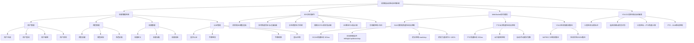

%% 系统功能模块树图
%% 第四章 系统总体设计 - 功能模块设计

```mermaid
graph TB
    Root["消防炮自动联动应用系统"]
    
    Root --> M1["权限管理系统"]
    Root --> M2["3D可视化操作"]
    Root --> M3["WebSocket实时通信"]
    Root --> M4["YOLO火焰检测与自动瞄准"]
    
    M1 --> M1a["用户管理"]
    M1 --> M1b["角色管理"]
    M1 --> M1c["权限管理"]
    M1 --> M1d["认证管理"]
    
    M1a --> M1a1["用户注册"]
    M1a --> M1a2["用户查询"]
    M1a --> M1a3["用户编辑"]
    M1a --> M1a4["用户禁用"]
    
    M1b --> M1b1["角色创建"]
    M1b --> M1b2["角色授权"]
    M1b --> M1b3["角色分配"]
    
    M1c --> M1c1["权限定义"]
    M1c --> M1c2["权限分配"]
    M1c --> M1c3["权限校验"]
    
    M1d --> M1d1["登录认证"]
    M1d --> M1d2["令牌签发"]
    M1d --> M1d3["令牌刷新"]
    M1d --> M1d4["登出注销"]
    
    M2 --> M2a["消防炮3D模型渲染"]
    M2 --> M2b["实时角度同步与过渡动画"]
    M2 --> M2c["水柱喷射粒子系统"]
    M2 --> M2d["摄像头FOV扇形指示器"]
    M2 --> M2e["2D雷达FOV指示器"]
    M2 --> M2f["方向键控制+归位"]
    
    M3 --> M3a["SLM消防炮角度轮询与控制"]
    M3 --> M3b["PTZ云台角度轮询与控制"]
    M3 --> M3c["YOLO检测视频流推送"]
    
    M3a --> M3a1["GCAN角度轮询 100ms"]
    M3a --> M3a2["方向控制指令 left/right/up/down/stop"]
    M3a --> M3a3["喷水控制 start/stop"]
    M3a --> M3a4["喷射力度调节 0~100%"]
    
    M3b --> M3b1["PTZ角度轮询 200ms"]
    M3b --> M3b2["云台旋转控制"]
    M3b --> M3b3["自动/手动模式切换"]
    
    M3c --> M3c1["MJPEG二进制帧推送"]
    M3c --> M3c2["检测状态JSON推送"]
    
    M4 --> M4a["火焰检测与框标注"]
    M4 --> M4b["连续帧确认防误识别"]
    M4 --> M4c["火焰坐标→PTZ角度计算"]
    M4 --> M4d["PTZ→SLM联动控制"]
```