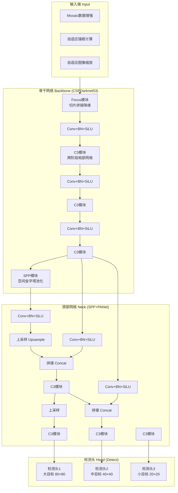

%% 图2-1: YOLOv5网络结构图
%% 第二章 相关技术与理论基础 - 2.1 YOLO目标检测技术

```mermaid
graph TB
    subgraph Input["输入端 Input"]
        Mosaic["Mosaic数据增强"]
        AutoAnchor["自适应锚框计算"]
        ImgSz["自适应图像缩放"]
    end

    subgraph Backbone["骨干网络 Backbone (CSPDarknet53)"]
        Focus["Focus模块<br/>切片拼接降维"]
        CBS1["Conv+BN+SiLU"]
        C3_1["C3模块<br/>跨阶段局部网络"]
        CBS2["Conv+BN+SiLU"]
        C3_2["C3模块"]
        CBS3["Conv+BN+SiLU"]
        C3_3["C3模块"]
        SPP["SPP模块<br/>空间金字塔池化"]
    end

    subgraph Neck["颈部网络 Neck (SPP+PANet)"]
        CBS4["Conv+BN+SiLU"]
        Upsample1["上采样 Upsample"]
        C3_4["C3模块"]
        Upsample2["上采样"]
        C3_5["C3模块"]
        CBS5["Conv+BN+SiLU"]
        Concat1["拼接 Concat"]
        C3_6["C3模块"]
        CBS6["Conv+BN+SiLU"]
        Concat2["拼接 Concat"]
        C3_7["C3模块"]
    end

    subgraph Head["检测头 Head (Detect)"]
        Detect1["检测头1<br/>大目标 80×80"]
        Detect2["检测头2<br/>中目标 40×40"]
        Detect3["检测头3<br/>小目标 20×20"]
    end

    Input --> Focus
    Focus --> CBS1 --> C3_1 --> CBS2 --> C3_2 --> CBS3 --> C3_3 --> SPP
    SPP --> CBS4 --> Upsample1 --> Concat1 --> C3_4 --> Upsample2 --> C3_5
    C3_3 --> CBS5 --> Concat1
    C3_4 --> Concat2
    C3_3 --> CBS6 --> Concat2 --> C3_6
    C3_5 --> Detect1
    C3_6 --> Detect2
    C3_7 --> Detect3
```