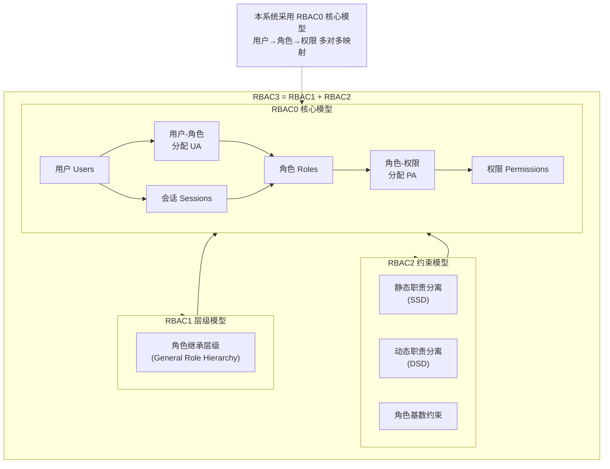

%% 图2-2: RBAC模型层次图
%% 第二章 相关技术与理论基础 - 2.5 RBAC权限管理模型

```mermaid
graph TB
    subgraph RBAC3["RBAC3 = RBAC1 + RBAC2<br/>(完整模型)"]
        subgraph RBAC2["RBAC2 约束模型"]
            SSD["静态职责分离<br/>(SSD)"]
            DSD["动态职责分离<br/>(DSD)"]
            Cardinality["角色基数约束"]
        end
        subgraph RBAC1["RBAC1 层级模型"]
            RoleHierarchy["角色继承层级<br/>(General Role Hierarchy)"]
        end
        subgraph RBAC0["RBAC0 核心模型"]
            Users["用户 Users"]
            Roles["角色 Roles"]
            Permissions["权限 Permissions"]
            Sessions["会话 Sessions"]
            UA["用户-角色<br/>分配 UA"]
            PA["角色-权限<br/>分配 PA"]
        end
    end

    RBAC1 --> RBAC0
    RBAC2 --> RBAC0
    RBAC3 --> RBAC1
    RBAC3 --> RBAC2

    Users --> UA --> Roles --> PA --> Permissions
    Users --> Sessions --> Roles

    Note1["本系统采用 RBAC0 核心模型<br/>用户→角色→权限 多对多映射"] -.-> RBAC0
```