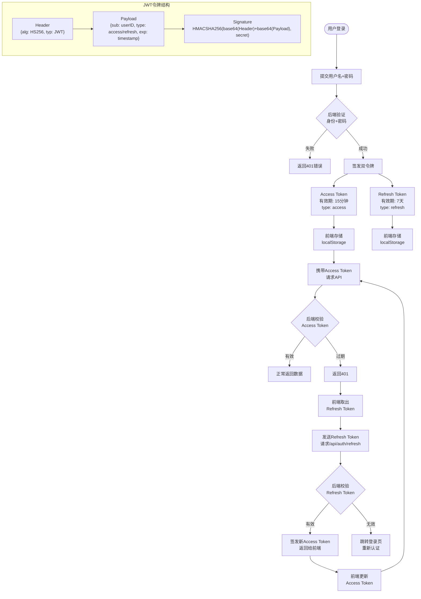

%% 图2-3: JWT双令牌认证流程图
%% 第二章 相关技术与理论基础 - 2.6 JWT认证机制

```mermaid
graph TB
    Start([用户登录]) --> Login[提交用户名+密码]
    Login --> Verify{后端验证<br/>身份+密码}
    Verify -->|失败| Fail[返回401错误]
    Verify -->|成功| Generate[签发双令牌]
    
    Generate --> AT["Access Token<br/>有效期: 15分钟<br/>type: access"]
    Generate --> RT["Refresh Token<br/>有效期: 7天<br/>type: refresh"]
    
    AT --> StoreAT[前端存储<br/>localStorage]
    RT --> StoreRT[前端存储<br/>localStorage]
    
    StoreAT --> Request[携带Access Token<br/>请求API]
    Request --> CheckAT{后端校验<br/>Access Token}
    
    CheckAT -->|有效| Success[正常返回数据]
    CheckAT -->|过期| Expired[返回401]
    
    Expired --> UseRT[前端取出<br/>Refresh Token]
    UseRT --> RefreshReq[发送Refresh Token<br/>请求/api/auth/refresh]
    RefreshReq --> CheckRT{后端校验<br/>Refresh Token}
    
    CheckRT -->|有效| NewAT[签发新Access Token<br/>返回给前端]
    CheckRT -->|无效| ReLogin[跳转登录页<br/>重新认证]
    
    NewAT --> StoreNewAT[前端更新<br/>Access Token]
    StoreNewAT --> Request

    subgraph JWT结构["JWT令牌结构"]
        Header["Header<br/>{alg: HS256, typ: JWT}"]
        Payload["Payload<br/>{sub: userID, type: access/refresh, exp: timestamp}"]
        Signature["Signature<br/>HMACSHA256(base64(Header)+base64(Payload), secret)"]
        Header --> Payload --> Signature
    end
```