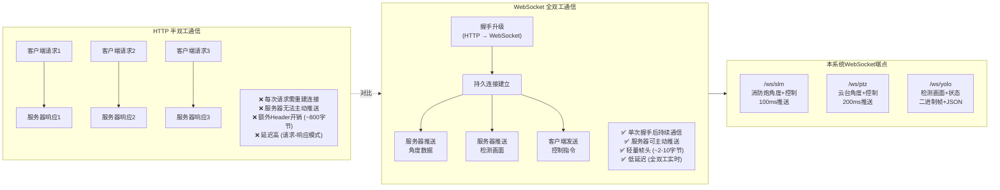

%% 图2-4: WebSocket vs HTTP对比图
%% 第二章 相关技术与理论基础 - 2.3 WebSocket实时通信技术

```mermaid
graph LR
    subgraph HTTP["HTTP 半双工通信"]
        direction TB
        HC1["客户端请求1"] --> HS1["服务器响应1"]
        HC2["客户端请求2"] --> HS2["服务器响应2"]
        HC3["客户端请求3"] --> HS3["服务器响应3"]
        HNote["❌ 每次请求需重建连接<br/>❌ 服务器无法主动推送<br/>❌ 额外Header开销 (~800字节)<br/>❌ 延迟高 (请求-响应模式)"]
    end

    subgraph WS["WebSocket 全双工通信"]
        direction TB
        WOpen["握手升级<br/>(HTTP → WebSocket)"]
        WOpen --> WConn["持久连接建立"]
        WConn --> WPush1["服务器推送<br/>角度数据"]
        WConn --> WPush2["服务器推送<br/>检测画面"]
        WConn --> WCmd["客户端发送<br/>控制指令"]
        WNote["✅ 单次握手后持续通信<br/>✅ 服务器可主动推送<br/>✅ 轻量帧头 (~2-10字节)<br/>✅ 低延迟 (全双工实时)"]
    end

    HTTP -.->|对比| WS

    subgraph 本系统应用["本系统WebSocket端点"]
        SLM["/ws/slm<br/>消防炮角度+控制<br/>100ms推送"]
        PTZ["/ws/ptz<br/>云台角度+控制<br/>200ms推送"]
        YOLO["/ws/yolo<br/>检测画面+状态<br/>二进制帧+JSON"]
    end

    WS --> 本系统应用
```