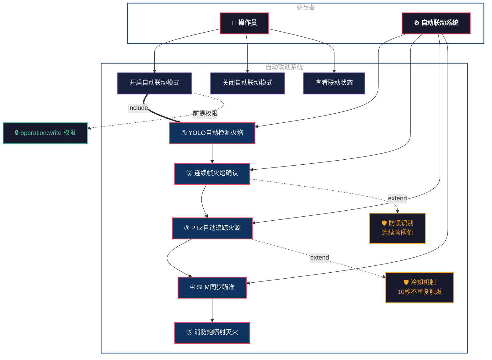

%% 图3-1: 自动联动用例图
%% 第三章 系统需求分析 - 3.1.1 自动联动功能需求

```mermaid
graph TB
    %% ── 样式定义 ──
    classDef actor     fill:#1a1a2e,stroke:#e94560,stroke-width:2px,color:#fff,font-weight:bold
    classDef ucOp      fill:#16213e,stroke:#533483,stroke-width:2px,color:#eee
    classDef ucCore    fill:#0f3460,stroke:#e94560,stroke-width:2px,color:#fff
    classDef ucProtect fill:#1a1a2e,stroke:#f5a623,stroke-width:2px,color:#f5a623
    classDef ucPerm    fill:#1a1a2e,stroke:#4ecca3,stroke-width:2px,color:#4ecca3
    classDef boundary  fill:none,stroke:#0f3460,stroke-width:2px,color:#aaa

    %% ── 参与者 ──
    subgraph Actors["　参与者　"]
        direction LR
        Op["👤 操作员"]
        Sys["⚙️ 自动联动系统"]
    end

    %% ── 系统边界 ──
    subgraph Boundary["　自动联动系统　"]
        direction TB

        %% 用户操作层
        UC01["开启自动联动模式"]
        UC02["关闭自动联动模式"]
        UC03["查看联动状态"]

        %% 核心联动链路
        UC04["① YOLO自动检测火焰"]
        UC05["② 连续帧火焰确认"]
        UC06["③ PTZ自动追踪火源"]
        UC07["④ SLM同步瞄准"]
        UC08["⑤ 消防炮喷射灭火"]

        %% 防护机制
        UC09["🛡 防误识别<br/>连续帧阈值"]
        UC10["🛡 冷却机制<br/>10秒不重复触发"]
    end

    %% ── 关系：操作员 → 用户操作 ──
    Op --> UC01
    Op --> UC02
    Op --> UC03

    %% ── 关系：自动联动系统 → 核心链路 ──
    Sys --> UC04
    Sys --> UC05
    Sys --> UC06
    Sys --> UC07

    %% ── 关系：核心联动链路流程 ──
    UC01 ==>|include| UC04
    UC04 --> UC05
    UC05 --> UC06
    UC06 --> UC07
    UC07 --> UC08

    %% ── 关系：扩展防护 ──
    UC05 -.->|extend| UC09
    UC06 -.->|extend| UC10

    %% ── 关系：权限前提 ──
    UC01 -.->|前提权限| UC11["🔒 operation:write 权限"]

    %% ── 应用样式 ──
    class Op,Sys actor
    class UC01,UC02,UC03 ucOp
    class UC04,UC05,UC06,UC07,UC08 ucCore
    class UC09,UC10 ucProtect
    class UC11 ucPerm
    class Actors,Boundary boundary
```