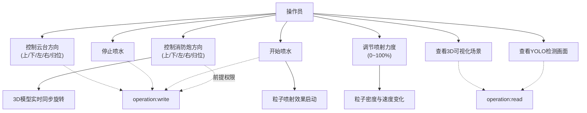

%% 图3-2: 远程控制用例图
%% 第三章 系统需求分析 - 3.1.2 远程控制功能需求

```mermaid
graph TB
    ActorOperator["操作员"]

    ActorOperator --> UC_SLM_CTRL["控制消防炮方向<br/>(上/下/左/右/归位)"]
    ActorOperator --> UC_SPRAY_START["开始喷水"]
    ActorOperator --> UC_SPRAY_STOP["停止喷水"]
    ActorOperator --> UC_PRESSURE["调节喷射力度<br/>(0~100%)"]
    ActorOperator --> UC_PTZ_CTRL["控制云台方向<br/>(上/下/左/右/归位)"]
    ActorOperator --> UC_VIEW_YOLO["查看YOLO检测画面"]
    ActorOperator --> UC_VIEW_3D["查看3D可视化场景"]

    UC_SLM_CTRL -.->|前提权限| UC_PERM1["operation:write"]
    UC_SPRAY_START -.-> UC_PERM1
    UC_SPRAY_STOP -.-> UC_PERM1
    UC_PTZ_CTRL -.-> UC_PERM1
    UC_VIEW_YOLO -.-> UC_PERM2["operation:read"]
    UC_VIEW_3D -.-> UC_PERM2

    UC_SLM_CTRL --> UC_3D_SYNC["3D模型实时同步旋转"]
    UC_SPRAY_START --> UC_PARTICLE["粒子喷射效果启动"]
    UC_PRESSURE --> UC_PARTICLE_CHANGE["粒子密度与速度变化"]
```