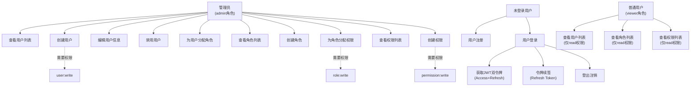

%% 图3-3: 权限管理用例图
%% 第三章 系统需求分析 - 3.1.4 权限管理功能需求

```mermaid
graph TB
    ActorAdmin["管理员<br/>(admin角色)"]
    ActorViewer["普通用户<br/>(viewer角色)"]
    ActorUser["未登录用户"]

    ActorUser --> UC_REG["用户注册"]
    ActorUser --> UC_LOGIN["用户登录"]
    UC_LOGIN --> UC_GET_TOKEN["获取JWT双令牌<br/>(Access+Refresh)"]

    ActorAdmin --> UC_USER_LIST["查看用户列表"]
    ActorAdmin --> UC_USER_CREATE["创建用户"]
    ActorAdmin --> UC_USER_EDIT["编辑用户信息"]
    ActorAdmin --> UC_USER_DISABLE["禁用用户"]
    ActorAdmin --> UC_USER_ROLE["为用户分配角色"]

    ActorAdmin --> UC_ROLE_LIST["查看角色列表"]
    ActorAdmin --> UC_ROLE_CREATE["创建角色"]
    ActorAdmin --> UC_ROLE_PERM["为角色分配权限"]

    ActorAdmin --> UC_PERM_LIST["查看权限列表"]
    ActorAdmin --> UC_PERM_CREATE["创建权限"]

    ActorViewer --> UC_VIEW_USER["查看用户列表<br/>(仅read权限)"]
    ActorViewer --> UC_VIEW_ROLE["查看角色列表<br/>(仅read权限)"]
    ActorViewer --> UC_VIEW_PERM["查看权限列表<br/>(仅read权限)"]

    UC_USER_CREATE -.->|需要权限| UC_PERM_UW["user:write"]
    UC_ROLE_PERM -.->|需要权限| UC_PERM_RW["role:write"]
    UC_PERM_CREATE -.->|需要权限| UC_PERM_PW["permission:write"]

    UC_LOGIN --> UC_REFRESH["令牌续签<br/>(Refresh Token)"]
    UC_LOGIN --> UC_LOGOUT["登出注销"]
```