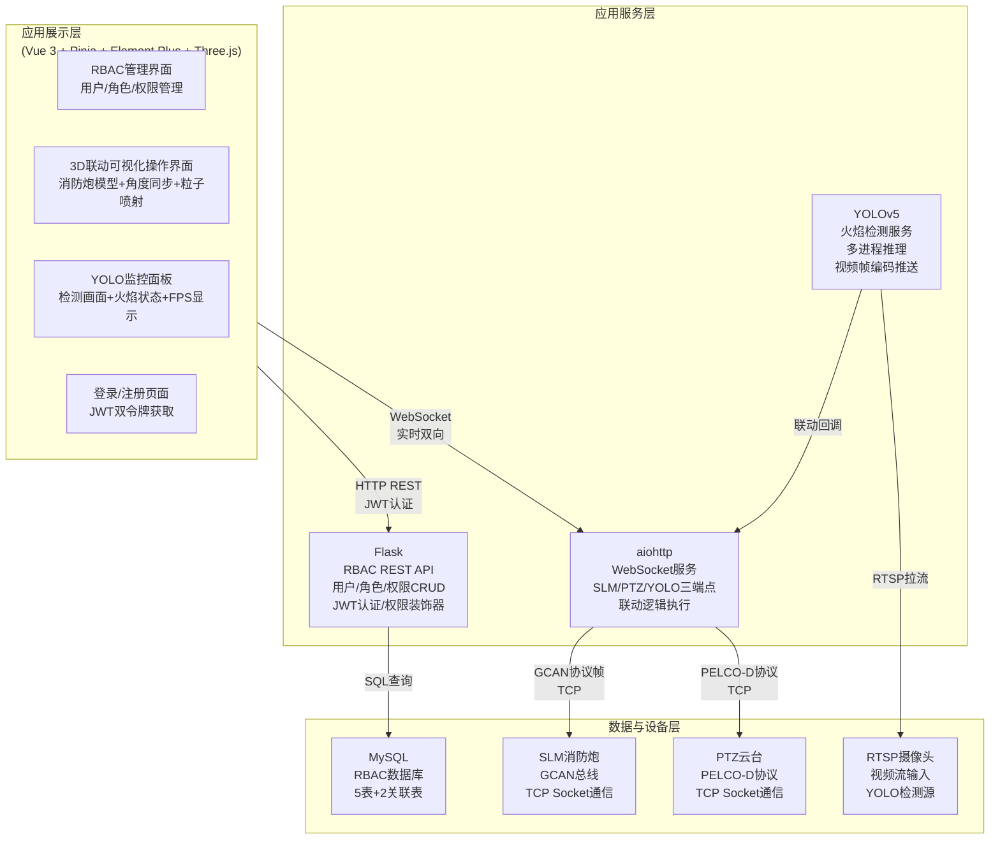

%% 图4-1: 系统三层架构图
%% 第四章 系统总体设计 - 4.1 系统架构设计

```mermaid
graph TB
    subgraph Presentation["应用展示层<br/>(Vue 3 + Pinia + Element Plus + Three.js)"]
        P1["RBAC管理界面<br/>用户/角色/权限管理"]
        P2["3D联动可视化操作界面<br/>消防炮模型+角度同步+粒子喷射"]
        P3["YOLO监控面板<br/>检测画面+火焰状态+FPS显示"]
        P4["登录/注册页面<br/>JWT双令牌获取"]
    end

    subgraph Service["应用服务层"]
        S1["Flask<br/>RBAC REST API<br/>用户/角色/权限CRUD<br/>JWT认证/权限装饰器"]
        S2["aiohttp<br/>WebSocket服务<br/>SLM/PTZ/YOLO三端点<br/>联动逻辑执行"]
        S3["YOLOv5<br/>火焰检测服务<br/>多进程推理<br/>视频帧编码推送"]
    end

    subgraph DataDevice["数据与设备层"]
        D1["MySQL<br/>RBAC数据库<br/>5表+2关联表"]
        D2["SLM消防炮<br/>GCAN总线<br/>TCP Socket通信"]
        D3["PTZ云台<br/>PELCO-D协议<br/>TCP Socket通信"]
        D4["RTSP摄像头<br/>视频流输入<br/>YOLO检测源"]
    end

    Presentation -->|HTTP REST<br/>JWT认证| S1
    Presentation -->|WebSocket<br/>实时双向| S2

    S1 -->|SQL查询| D1
    S2 -->|GCAN协议帧<br/>TCP| D2
    S2 -->|PELCO-D协议<br/>TCP| D3
    S3 -->|RTSP拉流| D4
    S3 -->|联动回调| S2
```