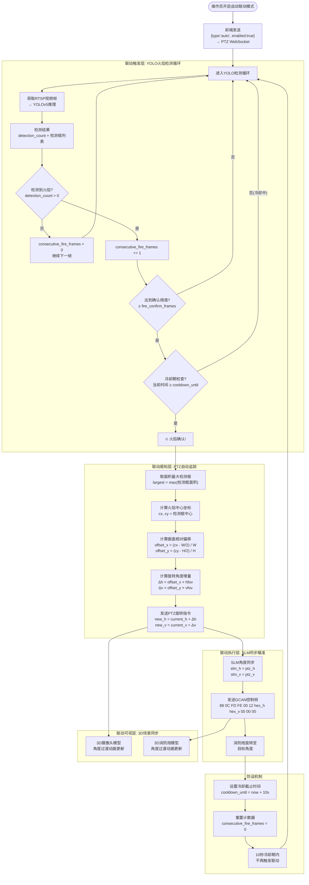

%% 图4-2: 自动联动链路流程图（论文最核心图）
%% 第四章 系统总体设计 - 4.2 自动联动链路设计

```mermaid
graph TB
    Start([操作员开启自动联动模式]) --> ModeSwitch["前端发送<br/>{type:'auto', enabled:true}<br/>→ PTZ WebSocket"]
    ModeSwitch --> YOLOLoop["进入YOLO检测循环"]
    
    subgraph DetectLoop["联动触发层: YOLO火焰检测循环"]
        YOLOLoop --> Frame["获取RTSP视频帧<br/>→ YOLOv5推理"]
        Frame --> Result["检测结果<br/>detection_count + 检测框列表"]
        Result --> HasFire{"检测到火焰?<br/>detection_count > 0"}
        HasFire -->|否| Reset["consecutive_fire_frames = 0<br/>继续下一帧"]
        Reset --> YOLOLoop
        
        HasFire -->|是| Increment["consecutive_fire_frames += 1"]
        Increment --> Confirm{"达到确认阈值?<br/>≥ fire_confirm_frames"}
        Confirm -->|否| YOLOLoop
        Confirm -->|是| CooldownCheck{"冷却期检查?<br/>当前时间 ≥ cooldown_until"}
        CooldownCheck -->|"否(冷却中)"| YOLOLoop
        CooldownCheck -->|是| FireConfirmed["🔥 火焰确认!"]
    end
    
    subgraph Tracking["联动感知层: PTZ自动追踪"]
        FireConfirmed --> GetLargest["取面积最大检测框<br/>largest = max(检测框面积)"]
        GetLargest --> CalcCenter["计算火焰中心坐标<br/>cx, cy = 检测框中心"]
        CalcCenter --> CalcOffset["计算画面相对偏移<br/>offset_x = (cx - W/2) / W<br/>offset_y = (cy - H/2) / H"]
        CalcOffset --> CalcAngle["计算旋转角度增量<br/>Δh = offset_x × hfov<br/>Δv = offset_y × vfov"]
        CalcAngle --> PTZRotate["发送PTZ旋转指令<br/>new_h = current_h + Δh<br/>new_v = current_v + Δv"]
    end
    
    subgraph Execution["联动执行层: SLM同步瞄准"]
        PTZRotate --> SyncSLM["SLM角度同步<br/>slm_h = ptz_h<br/>slm_v = ptz_v"]
        SyncSLM --> GCANCmd["发送GCAN控制帧<br/>88 0C FD FE 00 12 hex_h hex_v 00 00 00"]
        GCANCmd --> CannonRotate["消防炮旋转至<br/>目标角度"]
    end
    
    subgraph Cooldown["防误机制"]
        CannonRotate --> SetCooldown["设置冷却截止时间<br/>cooldown_until = now + 10s"]
        SetCooldown --> ResetCounter["重置计数器<br/>consecutive_fire_frames = 0"]
        ResetCounter --> WaitCooldown["10秒冷却期内<br/>不再触发联动"]
        WaitCooldown --> YOLOLoop
    end
    
    subgraph Visualization["联动可视层: 3D场景同步"]
        PTZRotate --> 3DPTZ["3D摄像头模型<br/>角度过渡动画更新"]
        GCANCmd --> 3DSLM["3D消防炮模型<br/>角度过渡动画更新"]
    end
```