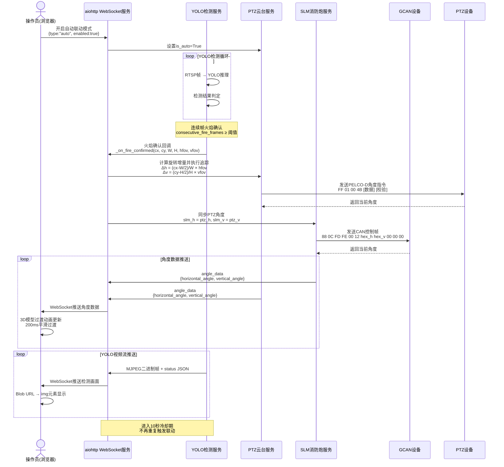

%% 图4-3: 联动链路时序图
%% 第四章 系统总体设计 - 4.2 自动联动链路设计

```mermaid
sequenceDiagram
    actor Op as 操作员(浏览器)
    participant WS as aiohttp WebSocket服务
    participant YOLO as YOLO检测服务
    participant PTZ as PTZ云台服务
    participant SLM as SLM消防炮服务
    participant GCAN as GCAN设备
    participant PTZDev as PTZ设备
    
    Op->>WS: 开启自动联动模式<br/>{type:"auto", enabled:true}
    WS->>PTZ: 设置is_auto=True
    
    loop YOLO检测循环
        YOLO->>YOLO: RTSP帧 → YOLO推理
        YOLO->>YOLO: 检测结果判定
    end
    
    Note over YOLO: 连续帧火焰确认<br/>consecutive_fire_frames ≥ 阈值
    
    YOLO->>WS: 火焰确认回调<br/>_on_fire_confirmed(cx, cy, W, H, hfov, vfov)
    WS->>PTZ: 计算旋转增量并执行追踪<br/>Δh = (cx-W/2)/W × hfov<br/>Δv = (cy-H/2)/H × vfov
    PTZ->>PTZDev: 发送PELCO-D角度指令<br/>FF 01 00 4B [数据] [校验]
    PTZDev-->>PTZ: 返回当前角度
    
    WS->>SLM: 同步PTZ角度<br/>slm_h = ptz_h, slm_v = ptz_v
    SLM->>GCAN: 发送CAN控制帧<br/>88 0C FD FE 00 12 hex_h hex_v 00 00 00
    GCAN-->>SLM: 返回当前角度
    
    loop 角度数据推送
        SLM->>WS: angle_data<br/>{horizontal_angle, vertical_angle}
        PTZ->>WS: angle_data<br/>{horizontal_angle, vertical_angle}
        WS->>Op: WebSocket推送角度数据
        Op->>Op: 3D模型过渡动画更新<br/>200ms平滑过渡
    end
    
    loop YOLO视频流推送
        YOLO->>WS: MJPEG二进制帧 + status JSON
        WS->>Op: WebSocket推送检测画面
        Op->>Op: Blob URL → img元素显示
    end
    
    Note over YOLO,WS: 进入10秒冷却期<br/>不再重复触发联动
```