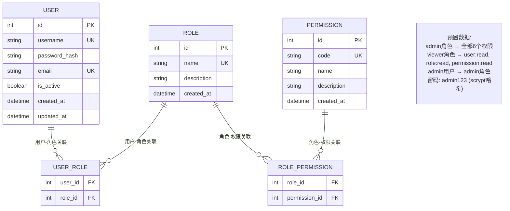

%% 图4-4: 数据库E-R图
%% 第四章 系统总体设计 - 4.3 数据库设计

```mermaid
erDiagram
    USER {
        int id PK
        string username UK
        string password_hash
        string email UK
        boolean is_active
        datetime created_at
        datetime updated_at
    }
    
    ROLE {
        int id PK
        string name UK
        string description
        datetime created_at
    }
    
    PERMISSION {
        int id PK
        string code UK
        string name
        string description
        datetime created_at
    }
    
    USER_ROLE {
        int user_id FK
        int role_id FK
    }
    
    ROLE_PERMISSION {
        int role_id FK
        int permission_id FK
    }

    USER ||--o{ USER_ROLE : "用户-角色关联"
    ROLE ||--o{ USER_ROLE : "用户-角色关联"
    ROLE ||--o{ ROLE_PERMISSION : "角色-权限关联"
    PERMISSION ||--o{ ROLE_PERMISSION : "角色-权限关联"
    
    Note1["预置数据:<br/>admin角色 → 全部6个权限<br/>viewer角色 → user:read, role:read, permission:read<br/>admin用户 → admin角色<br/>密码: admin123 (scrypt哈希)"]
```