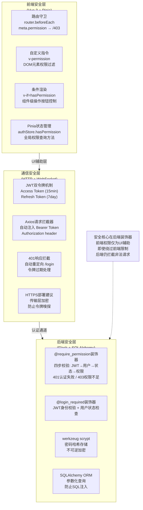

%% 图4-5: 安全体系三层架构图
%% 第四章 系统总体设计 - 4.5 安全设计

```mermaid
graph TB
    subgraph FrontendSec["前端安全层<br/>(Vue 3 + Pinia)"]
        F1["路由守卫<br/>router.beforeEach<br/>meta.permission → /403"]
        F2["自定义指令<br/>v-permission<br/>DOM元素权限过滤"]
        F3["条件渲染<br/>v-if=hasPermission<br/>组件级操作按钮控制"]
        F4["Pinia状态管理<br/>authStore.hasPermission<br/>全局权限查询方法"]
    end

    subgraph CommSec["通信安全层<br/>(HTTP + WebSocket)"]
        C1["JWT双令牌机制<br/>Access Token (15min)<br/>Refresh Token (7day)"]
        C2["Axios请求拦截器<br/>自动注入 Bearer Token<br/>Authorization header"]
        C3["401响应拦截<br/>自动重定向 /login<br/>令牌过期处理"]
        C4["HTTPS部署建议<br/>传输层加密<br/>防止令牌嗅探"]
    end

    subgraph BackendSec["后端安全层<br/>(Flask + SQLAlchemy)"]
        B1["@require_permission装饰器<br/>四步校验: JWT→用户→状态→权限<br/>401认证失败 / 403权限不足"]
        B2["@login_required装饰器<br/>JWT身份校验 + 用户状态检查"]
        B3["werkzeug scrypt<br/>密码哈希存储<br/>不可逆加密"]
        B4["SQLAlchemy ORM<br/>参数化查询<br/>防止SQL注入"]
    end

    FrontendSec -->|UI辅助层| CommSec
    CommSec -->|认证通道| BackendSec

    Note1["安全核心在后端装饰器<br/>前端权限仅为UI辅助<br/>即使绕过前端限制<br/>后端仍拦截非法请求"] -.-> BackendSec
```