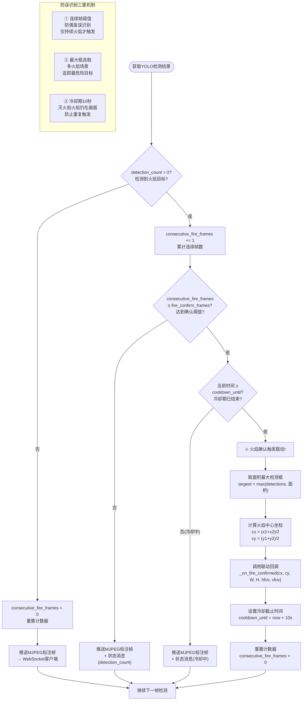

%% 图5-1: 火焰确认算法流程图
%% 第五章 系统详细设计与实现 - 5.1.2 火焰确认防误识别算法

```mermaid
graph TB
    Start([获取YOLO检测结果]) --> CheckCount{"detection_count > 0?<br/>检测到火焰目标?"}
    
    CheckCount -->|否| ResetCounter["consecutive_fire_frames = 0<br/>重置计数器"]
    ResetCounter --> PushFrame1["推送MJPEG标注帧<br/>→ WebSocket客户端"]
    PushFrame1 --> Continue["继续下一帧检测"]
    
    CheckCount -->|是| Increment["consecutive_fire_frames += 1<br/>累计连续帧数"]
    Increment --> CheckThreshold{"consecutive_fire_frames<br/>≥ fire_confirm_frames?<br/>达到确认阈值?"}
    
    CheckThreshold -->|否| PushFrame2["推送MJPEG标注帧<br/>+ 状态消息(detection_count)"]
    PushFrame2 --> Continue
    
    CheckThreshold -->|是| CheckCooldown{"当前时间 ≥<br/>cooldown_until?<br/>冷却期已结束?"}
    
    CheckCooldown -->|"否(冷却中)"| PushFrame3["推送MJPEG标注帧<br/>+ 状态消息(冷却中)"]
    PushFrame3 --> Continue
    
    CheckCooldown -->|是| FireConfirmed["🔥 火焰确认触发联动!"]
    FireConfirmed --> FindLargest["取面积最大检测框<br/>largest = max(detections, 面积)"]
    FindLargest --> CalcCenter["计算火焰中心坐标<br/>cx = (x1+x2)/2<br/>cy = (y1+y2)/2"]
    CalcCenter --> TriggerCallback["调用联动回调<br/>_on_fire_confirmed(cx, cy, W, H, hfov, vfov)"]
    TriggerCallback --> SetCooldown["设置冷却截止时间<br/>cooldown_until = now + 10s"]
    SetCooldown --> ResetFinal["重置计数器<br/>consecutive_fire_frames = 0"]
    ResetFinal --> Continue

    subgraph Legend["防误识别三重机制"]
        L1["① 连续帧阈值<br/>防偶发误识别<br/>仅持续火焰才触发"]
        L2["② 最大框选取<br/>多火焰场景<br/>追踪最危险目标"]
        L3["③ 冷却期10秒<br/>灭火前火焰仍在画面<br/>防止重复触发"]
    end
```