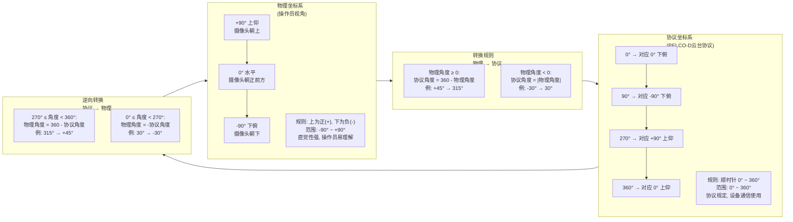

%% 图5-2: PTZ角度坐标系转换图
%% 第五章 系统详细设计与实现 - 5.2.2 垂直角度坐标系转换

```mermaid
graph LR
    subgraph Physical["物理坐标系<br/>(操作员视角)"]
        direction TB
        P_Up["+90° 上仰<br/>摄像头朝上"]
        P_Zero["0° 水平<br/>摄像头朝正前方"]
        P_Down["-90° 下俯<br/>摄像头朝下"]
        P_Up --> P_Zero --> P_Down
        PNote["规则: 上为正(+), 下为负(-)<br/>范围: -90° ~ +90°<br/>直觉性强, 操作员易理解"]
    end

    subgraph Protocol["协议坐标系<br/>(PELCO-D云台协议)"]
        direction TB
        Pr_360["360° → 对应 0° 上仰"]
        Pr_270["270° → 对应 +90° 上仰"]
        Pr_0["0° → 对应 0° 下俯"]
        Pr_90["90° → 对应 -90° 下俯"]
        Pr_0 --> Pr_90 --> Pr_270 --> Pr_360
        PrNote["规则: 顺时针 0° ~ 360°<br/>范围: 0° ~ 360°<br/>协议规定, 设备通信使用"]
    end

    subgraph Convert["转换规则<br/>物理 → 协议"]
        C1["物理角度 ≥ 0:<br/>协议角度 = 360 - 物理角度<br/>例: +45° → 315°"]
        C2["物理角度 < 0:<br/>协议角度 = |物理角度|<br/>例: -30° → 30°"]
    end

    subgraph ReverseConvert["逆向转换<br/>协议 → 物理"]
        R1["270° ≤ 角度 < 360°:<br/>物理角度 = 360 - 协议角度<br/>例: 315° → +45°"]
        R2["0° ≤ 角度 < 270°:<br/>物理角度 = -协议角度<br/>例: 30° → -30°"]
    end

    Physical --> Convert --> Protocol
    Protocol --> ReverseConvert --> Physical
```