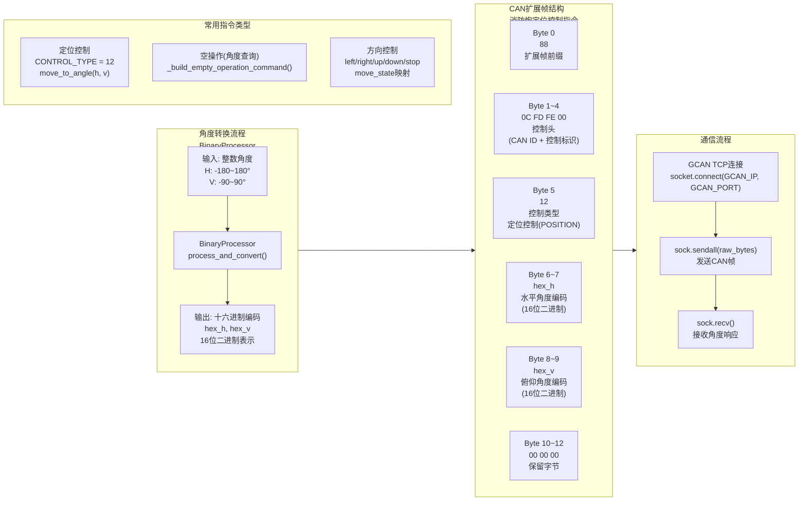

%% 图5-3: GCAN控制帧格式图
%% 第五章 系统详细设计与实现 - 5.3.1 GCAN总线通信实现

```mermaid
graph LR
    subgraph CANFrame["CAN扩展帧结构<br/>消防炮定位控制指令"]
        direction LR
        Byte0["Byte 0<br/>88<br/>扩展帧前缀"]
        Byte1_4["Byte 1~4<br/>0C FD FE 00<br/>控制头<br/>(CAN ID + 控制标识)"]
        Byte5["Byte 5<br/>12<br/>控制类型<br/>定位控制(POSITION)"]
        Byte6_7["Byte 6~7<br/>hex_h<br/>水平角度编码<br/>(16位二进制)"]
        Byte8_9["Byte 8~9<br/>hex_v<br/>俯仰角度编码<br/>(16位二进制)"]
        Byte10_12["Byte 10~12<br/>00 00 00<br/>保留字节"]
    end

    subgraph AngleConv["角度转换流程<br/>BinaryProcessor"]
        direction TB
        Input["输入: 整数角度<br/>H: -180~180°<br/>V: -90~90°"]
        Process["BinaryProcessor<br/>process_and_convert()"]
        Output["输出: 十六进制编码<br/>hex_h, hex_v<br/>16位二进制表示"]
        Input --> Process --> Output
    end

    subgraph Commands["常用指令类型"]
        PosCtrl["定位控制<br/>CONTROL_TYPE = 12<br/>move_to_angle(h, v)"]
        EmptyOp["空操作(角度查询)<br/>_build_empty_operation_command()"]
        DirectionCtrl["方向控制<br/>left/right/up/down/stop<br/>move_state映射"]
    end

    AngleConv --> CANFrame

    subgraph CommFlow["通信流程"]
        Connect["GCAN TCP连接<br/>socket.connect(GCAN_IP, GCAN_PORT)"]
        Send["sock.sendall(raw_bytes)<br/>发送CAN帧"]
        Recv["sock.recv()<br/>接收角度响应"]
        Connect --> Send --> Recv
    end

    CANFrame --> CommFlow
```