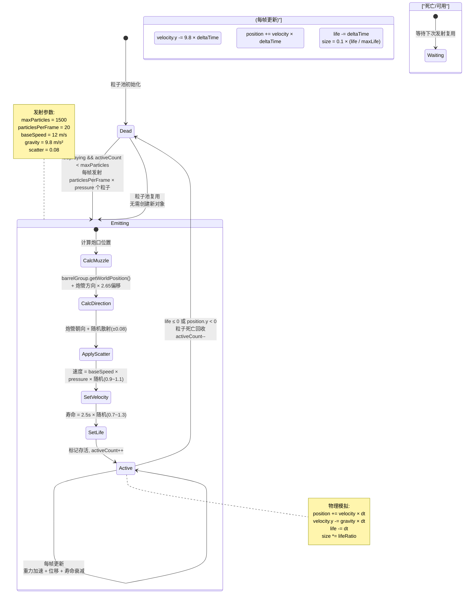

%% 图5-4: 粒子生命周期状态图
%% 第五章 系统详细设计与实现 - 5.4.3 水柱喷射粒子系统

```mermaid
stateDiagram-v2
    [*] --> Dead: 粒子池初始化
    
    Dead --> Emitting: isSpraying && activeCount < maxParticles<br/>每帧发射 particlesPerFrame × pressure 个粒子
    
    state Emitting {
        [*] --> CalcMuzzle: 计算炮口位置
        CalcMuzzle --> CalcDirection: barrelGroup.getWorldPosition()<br/>+ 炮管方向 × 2.65偏移
        CalcDirection --> ApplyScatter: 炮管朝向 + 随机散射(±0.08)
        ApplyScatter --> SetVelocity: 速度 = baseSpeed × pressure × 随机(0.9~1.1)
        SetVelocity --> SetLife: 寿命 = 2.5s × 随机(0.7~1.3)
        SetLife --> Active: 标记存活, activeCount++
    }
    
    state Active ["存活状态 (每帧更新)"] {
        Gravity: velocity.y -= 9.8 × deltaTime
        Move: position += velocity × deltaTime
        Decay: life -= deltaTime<br/>size = 0.1 × (life / maxLife)
    }
    
    Active --> Dead: life ≤ 0 或 position.y < 0<br/>粒子死亡回收<br/>activeCount--
    
    Active --> Active: 每帧更新<br/>重力加速 + 位移 + 寿命衰减
    
    state Dead ["死亡/可用"] {
        [*] --> Waiting: 等待下次发射复用
    }
    
    Dead --> Emitting: 粒子池复用<br/>无需创建新对象

    note right of Active
        物理模拟:
        position += velocity × dt
        velocity.y -= gravity × dt
        life -= dt
        size *= lifeRatio
    end note
    
    note left of Emitting
        发射参数:
        maxParticles = 1500
        particlesPerFrame = 20
        baseSpeed = 12 m/s
        gravity = 9.8 m/s²
        scatter = 0.08
    end note
```