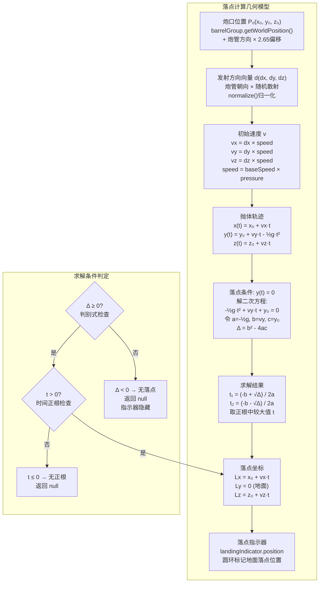

%% 图5-5: 落点计算几何示意图
%% 第五章 系统详细设计与实现 - 5.4.3 水柱喷射粒子系统

```mermaid
graph TB
    subgraph Geometry["落点计算几何模型<br/>抛体运动二次方程求解"]
        Muzzle["炮口位置 P₀(x₀, y₀, z₀)<br/>barrelGroup.getWorldPosition()<br/>+ 炮管方向 × 2.65偏移"]
        
        Direction["发射方向向量 d(dx, dy, dz)<br/>炮管朝向 × 随机散射<br/>normalize()归一化"]
        
        Velocity["初始速度 v<br/>vx = dx × speed<br/>vy = dy × speed<br/>vz = dz × speed<br/>speed = baseSpeed × pressure"]
        
        Trajectory["抛体轨迹<br/>x(t) = x₀ + vx·t<br/>y(t) = y₀ + vy·t - ½g·t²<br/>z(t) = z₀ + vz·t"]
        
        Landing["落点条件: y(t) = 0<br/>解二次方程:<br/>-½g·t² + vy·t + y₀ = 0<br/>令 a=-½g, b=vy, c=y₀<br/>Δ = b² - 4ac"]
        
        Solution["求解结果<br/>t₁ = (-b + √Δ) / 2a<br/>t₂ = (-b - √Δ) / 2a<br/>取正根中较大值 t"]
        
        LandingPoint["落点坐标<br/>Lx = x₀ + vx·t<br/>Ly = 0 (地面)<br/>Lz = z₀ + vz·t"]
        
        Indicator["落点指示器<br/>landingIndicator.position<br/>圆环标记地面落点位置"]
    end
    
    Muzzle --> Direction --> Velocity --> Trajectory
    Trajectory --> Landing --> Solution --> LandingPoint --> Indicator
    
    subgraph Conditions["求解条件判定"]
        C1{"Δ ≥ 0?<br/>判别式检查"}
        C2{"t > 0?<br/>时间正根检查"}
        C3["Δ < 0 → 无落点<br/>返回 null<br/>指示器隐藏"]
        C4["t ≤ 0 → 无正根<br/>返回 null"]
        C1 -->|"否"| C3
        C1 -->|"是"| C2
        C2 -->|"否"| C4
        C2 -->|"是"| LandingPoint
    end
```