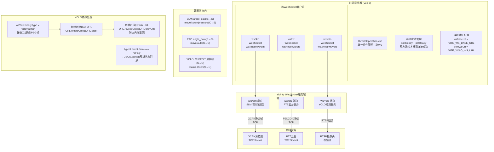

%% 图5-6: 三路WebSocket连接架构图
%% 第五章 系统详细设计与实现 - 5.4.4 三路WebSocket客户端管理

```mermaid
graph TB
    subgraph Browser["前端浏览器 (Vue 3)"]
        VueApp["ThreeDOperation.vue<br/>单一组件管理三路WS"]
        
        subgraph WSClients["三路WebSocket客户端"]
            wsSlm["wsSlm<br/>WebSocket<br/>ws://host/ws/slm"]
            wsPtz["wsPtz<br/>WebSocket<br/>ws://host/ws/ptz"]
            wsYolo["wsYolo<br/>WebSocket<br/>ws://host/ws/yolo"]
        end
        
        Status["连接状态管理<br/>slmReady + ptzReady<br/>双方就绪才标记连接成功"]
        
        WSUrl["连接地址配置<br/>wsBaseUrl = VITE_WS_BASE_URL<br/>yoloWsUrl = VITE_YOLO_WS_URL"]
    end

    subgraph Server["aiohttp WebSocket服务端<br/>端口 8765"]
        slmHandler["/ws/slm 端点<br/>SLM消防炮服务"]
        ptzHandler["/ws/ptz 端点<br/>PTZ云台服务"]
        yoloHandler["/ws/yolo 端点<br/>YOLO检测服务"]
    end

    subgraph Devices["物理设备"]
        GCANDev["GCAN消防炮<br/>TCP Socket"]
        PTZDev["PTZ云台<br/>TCP Socket"]
        RTSPCam["RTSP摄像头<br/>视频流"]
    end

    wsSlm --> slmHandler
    wsPtz --> ptzHandler
    wsYolo --> yoloHandler

    slmHandler -->|"GCAN协议帧<br/>TCP"| GCANDev
    ptzHandler -->|"PELCO-D协议<br/>TCP"| PTZDev
    yoloHandler -->|"RTSP拉流"| RTSPCam

    subgraph DataFlow["数据流方向"]
        D1["SLM: angle_data(S→C)<br/>move/spray/pressure(C→S)"]
        D2["PTZ: angle_data(S→C)<br/>move/auto(C→S)"]
        D3["YOLO: MJPEG二进制帧(S→C)<br/>status JSON(S→C)"]
    end

    subgraph YoloSpecial["YOLO特殊处理"]
        BinaryType["wsYolo.binaryType = 'arraybuffer'<br/>接收二进制JPEG帧"]
        BlobURL["每帧创建Blob URL<br/>URL.createObjectURL(blob)"]
        Revoke["每帧释放旧Blob URL<br/>URL.revokeObjectURL(prevUrl)<br/>防止内存泄漏"]
        JSONParse["typeof event.data === 'string'<br/>→ JSON.parse()解析状态消息"]
        BinaryType --> BlobURL --> Revoke
    end
```