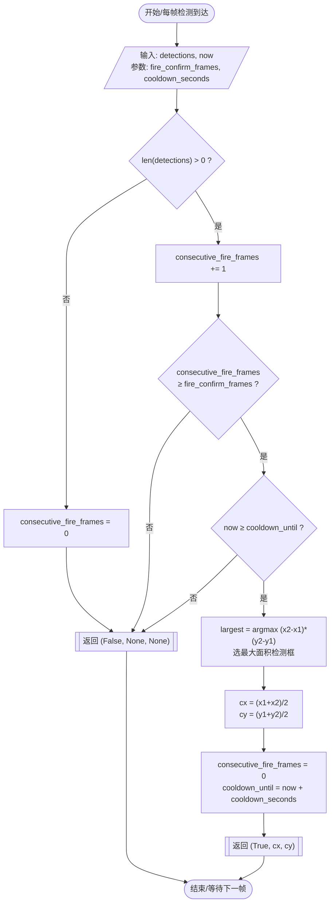

%% 图6-1: 火焰连续帧确认与冷却防误识别算法流程图
%% 第6章 核心算法设计 - 6.1 算法6-1

```mermaid
flowchart TB
    Start([开始/每帧检测到达]) --> Input[/"输入: detections, now<br/>参数: fire_confirm_frames, cooldown_seconds"/]
    Input --> Check{"len(detections) > 0 ?"}

    Check -->|是| Inc["consecutive_fire_frames += 1"]
    Check -->|否| Reset["consecutive_fire_frames = 0"]

    Reset --> NotFire[["返回 (False, None, None)"]]

    Inc --> Th{"consecutive_fire_frames<br/>≥ fire_confirm_frames ?"}
    Th -->|否| NotFire
    Th -->|是| Cool{"now ≥ cooldown_until ?"}
    Cool -->|否| NotFire

    Cool -->|是| Largest["largest = argmax (x2-x1)*(y2-y1)<br/>选最大面积检测框"]
    Largest --> Center["cx = (x1+x2)/2<br/>cy = (y1+y2)/2"]
    Center --> Update["consecutive_fire_frames = 0<br/>cooldown_until = now + cooldown_seconds"]
    Update --> Fire[["返回 (True, cx, cy)"]]

    NotFire --> End([结束/等待下一帧])
    Fire --> End
```
