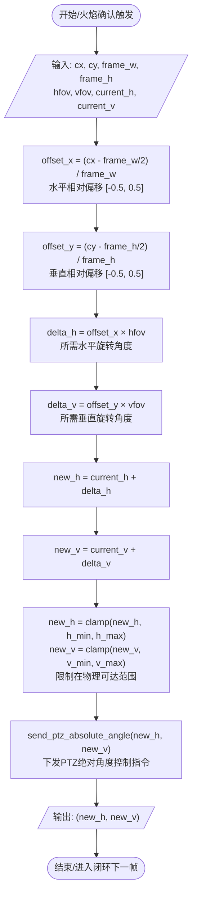

%% 图6-2: 画面坐标到云台旋转增量的自动追踪算法流程图
%% 第6章 核心算法设计 - 6.2 算法6-2

```mermaid
flowchart TB
    Start([开始/火焰确认触发]) --> Input[/"输入: cx, cy, frame_w, frame_h<br/>hfov, vfov, current_h, current_v"/]

    Input --> OffX["offset_x = (cx - frame_w/2) / frame_w<br/>水平相对偏移 [-0.5, 0.5]"]
    OffX --> OffY["offset_y = (cy - frame_h/2) / frame_h<br/>垂直相对偏移 [-0.5, 0.5]"]

    OffY --> DH["delta_h = offset_x × hfov<br/>所需水平旋转角度"]
    DH --> DV["delta_v = offset_y × vfov<br/>所需垂直旋转角度"]

    DV --> NewH["new_h = current_h + delta_h"]
    NewH --> NewV["new_v = current_v + delta_v"]

    NewV --> Clamp["new_h = clamp(new_h, h_min, h_max)<br/>new_v = clamp(new_v, v_min, v_max)<br/>限制在物理可达范围"]

    Clamp --> Send["send_ptz_absolute_angle(new_h, new_v)<br/>下发PTZ绝对角度控制指令"]

    Send --> Output[/"输出: (new_h, new_v)"/]
    Output --> End([结束/进入闭环下一帧])
```
