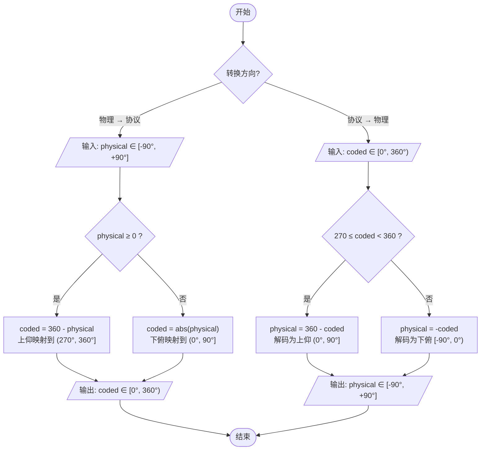

%% 图6-3: 云台垂直角度坐标系转换算法流程图
%% 第6章 核心算法设计 - 6.3 算法6-3

```mermaid
flowchart TB
    Start([开始]) --> Mode{"转换方向?"}

    Mode -->|"物理 → 协议"| P1[/"输入: physical ∈ [-90°, +90°]"/]
    P1 --> PC{"physical ≥ 0 ?"}
    PC -->|是| PUp["coded = 360 - physical<br/>上仰映射到 (270°, 360°]"]
    PC -->|否| PDown["coded = abs(physical)<br/>下俯映射到 (0°, 90°]"]
    PUp --> POut[/"输出: coded ∈ [0°, 360°)"/]
    PDown --> POut

    Mode -->|"协议 → 物理"| R1[/"输入: coded ∈ [0°, 360°)"/]
    R1 --> RC{"270 ≤ coded < 360 ?"}
    RC -->|是| RUp["physical = 360 - coded<br/>解码为上仰 (0°, 90°]"]
    RC -->|否| RDown["physical = -coded<br/>解码为下俯 [-90°, 0°)"]
    RUp --> ROut[/"输出: physical ∈ [-90°, +90°]"/]
    RDown --> ROut

    POut --> End([结束])
    ROut --> End
```
