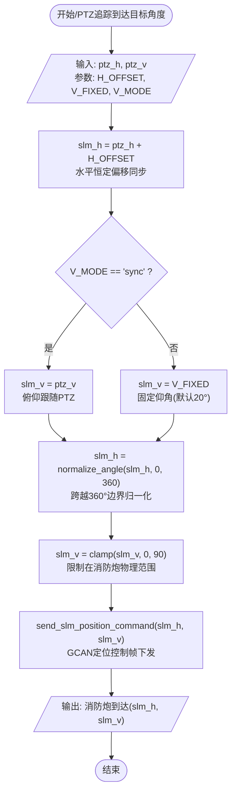

%% 图6-4: 消防炮与云台角度同步映射算法流程图
%% 第6章 核心算法设计 - 6.4 算法6-4

```mermaid
flowchart TB
    Start([开始/PTZ追踪到达目标角度]) --> Input[/"输入: ptz_h, ptz_v<br/>参数: H_OFFSET, V_FIXED, V_MODE"/]

    Input --> HCalc["slm_h = ptz_h + H_OFFSET<br/>水平恒定偏移同步"]

    HCalc --> VMode{"V_MODE == 'sync' ?"}
    VMode -->|是| VSync["slm_v = ptz_v<br/>俯仰跟随PTZ"]
    VMode -->|否| VFixed["slm_v = V_FIXED<br/>固定仰角(默认20°)"]

    VSync --> Norm["slm_h = normalize_angle(slm_h, 0, 360)<br/>跨越360°边界归一化"]
    VFixed --> Norm

    Norm --> Clamp["slm_v = clamp(slm_v, 0, 90)<br/>限制在消防炮物理范围"]

    Clamp --> Send["send_slm_position_command(slm_h, slm_v)<br/>GCAN定位控制帧下发"]

    Send --> Output[/"输出: 消防炮到达(slm_h, slm_v)"/]
    Output --> End([结束])
```
