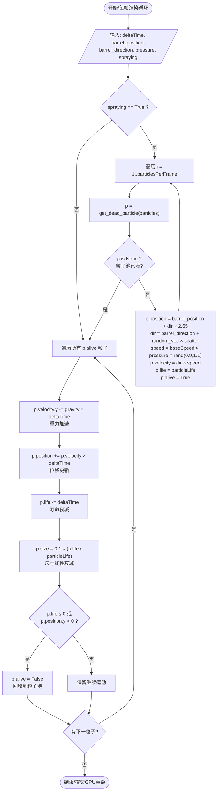

%% 图6-5: 水柱喷射粒子抛体物理模拟算法流程图
%% 第6章 核心算法设计 - 6.5 算法6-5

```mermaid
flowchart TB
    Start([开始/每帧渲染循环]) --> Input[/"输入: deltaTime, barrel_position,<br/>barrel_direction, pressure, spraying"/]

    Input --> Spraying{"spraying == True ?"}
    Spraying -->|否| UpdateAll
    Spraying -->|是| EmitLoop["遍历 i = 1..particlesPerFrame"]

    EmitLoop --> GetDead["p = get_dead_particle(particles)"]
    GetDead --> PoolEmpty{"p is None ?<br/>粒子池已满?"}
    PoolEmpty -->|是| UpdateAll
    PoolEmpty -->|否| Init["p.position = barrel_position + dir × 2.65<br/>dir = barrel_direction + random_vec × scatter<br/>speed = baseSpeed × pressure × rand(0.9,1.1)<br/>p.velocity = dir × speed<br/>p.life = particleLife<br/>p.alive = True"]
    Init --> EmitLoop

    UpdateAll["遍历所有 p.alive 粒子"] --> Gravity["p.velocity.y -= gravity × deltaTime<br/>重力加速"]
    Gravity --> Move["p.position += p.velocity × deltaTime<br/>位移更新"]
    Move --> Life["p.life -= deltaTime<br/>寿命衰减"]
    Life --> Size["p.size = 0.1 × (p.life / particleLife)<br/>尺寸线性衰减"]
    Size --> Die{"p.life ≤ 0 或<br/>p.position.y < 0 ?"}
    Die -->|是| Recycle["p.alive = False<br/>回收到粒子池"]
    Die -->|否| Keep["保留继续运动"]
    Recycle --> NextP{有下一粒子?}
    Keep --> NextP
    NextP -->|是| UpdateAll
    NextP -->|否| End([结束/提交GPU渲染])
```
