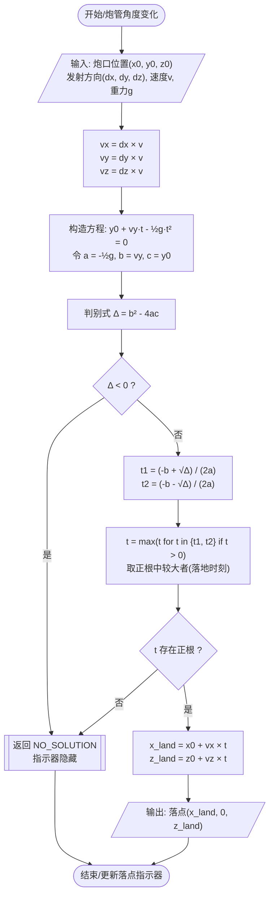

%% 图6-6: 水柱落点二次方程求解算法流程图
%% 第6章 核心算法设计 - 6.6 算法6-6

```mermaid
flowchart TB
    Start([开始/炮管角度变化]) --> Input[/"输入: 炮口位置(x0, y0, z0)<br/>发射方向(dx, dy, dz), 速度v, 重力g"/]

    Input --> Vel["vx = dx × v<br/>vy = dy × v<br/>vz = dz × v"]

    Vel --> Coef["构造方程: y0 + vy·t - ½g·t² = 0<br/>令 a = -½g, b = vy, c = y0"]

    Coef --> Disc["判别式 Δ = b² - 4ac"]

    Disc --> CheckDisc{"Δ < 0 ?"}
    CheckDisc -->|是| NoSol[["返回 NO_SOLUTION<br/>指示器隐藏"]]
    CheckDisc -->|否| Roots["t1 = (-b + √Δ) / (2a)<br/>t2 = (-b - √Δ) / (2a)"]

    Roots --> Pick["t = max(t for t in {t1, t2} if t > 0)<br/>取正根中较大者(落地时刻)"]

    Pick --> HasPos{"t 存在正根 ?"}
    HasPos -->|否| NoSol
    HasPos -->|是| Land["x_land = x0 + vx × t<br/>z_land = z0 + vz × t"]

    Land --> Output[/"输出: 落点(x_land, 0, z_land)"/]
    Output --> End([结束/更新落点指示器])
    NoSol --> End
```
