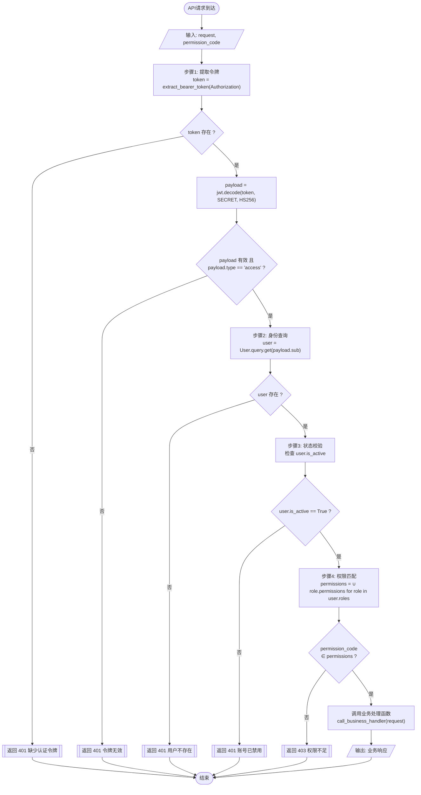

%% 图6-7: RBAC四步权限校验算法流程图
%% 第6章 核心算法设计 - 6.7 算法6-7

```mermaid
flowchart TB
    Start([API请求到达]) --> Input[/"输入: request, permission_code"/]

    Input --> Step1["步骤1: 提取令牌<br/>token = extract_bearer_token(Authorization)"]
    Step1 --> T1{"token 存在 ?"}
    T1 -->|否| E401A[["返回 401 缺少认证令牌"]]
    T1 -->|是| Decode["payload = jwt.decode(token, SECRET, HS256)"]

    Decode --> T2{"payload 有效 且<br/>payload.type == 'access' ?"}
    T2 -->|否| E401B[["返回 401 令牌无效"]]
    T2 -->|是| Step2["步骤2: 身份查询<br/>user = User.query.get(payload.sub)"]

    Step2 --> U1{"user 存在 ?"}
    U1 -->|否| E401C[["返回 401 用户不存在"]]
    U1 -->|是| Step3["步骤3: 状态校验<br/>检查 user.is_active"]

    Step3 --> U2{"user.is_active == True ?"}
    U2 -->|否| E401D[["返回 401 账号已禁用"]]
    U2 -->|是| Step4["步骤4: 权限匹配<br/>permissions = ∪ role.permissions for role in user.roles"]

    Step4 --> P1{"permission_code<br/>∈ permissions ?"}
    P1 -->|否| E403[["返回 403 权限不足"]]
    P1 -->|是| Call["调用业务处理函数<br/>call_business_handler(request)"]

    Call --> Out[/"输出: 业务响应"/]
    Out --> End([结束])
    E401A --> End
    E401B --> End
    E401C --> End
    E401D --> End
    E403 --> End
```
