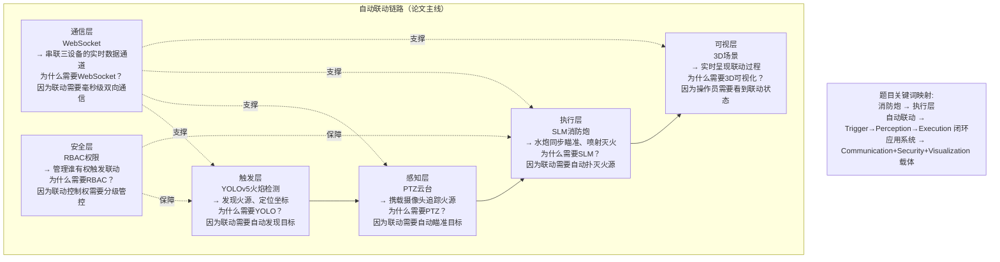

%% 联动六层架构图
%% 第一章 解题 - 1.2 对齐策略核心原则

```mermaid
graph TB
    subgraph Linkage["自动联动链路（论文主线）"]
        Trigger["触发层<br/>YOLOv5火焰检测<br/>→ 发现火源、定位坐标<br/>为什么需要YOLO？<br/>因为联动需要"自动发现目标""]
        Perception["感知层<br/>PTZ云台<br/>→ 携载摄像头追踪火源<br/>为什么需要PTZ？<br/>因为联动需要"自动瞄准目标""]
        Execution["执行层<br/>SLM消防炮<br/>→ 水炮同步瞄准、喷射灭火<br/>为什么需要SLM？<br/>因为联动需要"自动扑灭火源""]
        Visualization["可视层<br/>3D场景<br/>→ 实时呈现联动过程<br/>为什么需要3D可视化？<br/>因为操作员需要"看到联动状态""]
        Communication["通信层<br/>WebSocket<br/>→ 串联三设备的实时数据通道<br/>为什么需要WebSocket？<br/>因为联动需要"毫秒级双向通信""]
        Security["安全层<br/>RBAC权限<br/>→ 管理谁有权触发联动<br/>为什么需要RBAC？<br/>因为联动控制权需要"分级管控""]
    end

    Trigger --> Perception --> Execution
    Execution --> Visualization
    Communication -.->|"支撑"| Trigger
    Communication -.->|"支撑"| Perception
    Communication -.->|"支撑"| Execution
    Communication -.->|"支撑"| Visualization
    Security -.->|"保障"| Trigger
    Security -.->|"保障"| Execution

    Note1["题目关键词映射:<br/>消防炮 → 执行层<br/>自动联动 → Trigger→Perception→Execution 闭环<br/>应用系统 → Communication+Security+Visualization 载体"]
```